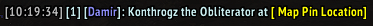

# Useful Information
This stuff doesn't belong to a specific expansion.

---

This is only relevant to anyone who logs raids/dungeons/whatever.

As of Patch 9.0.5 the client automatically splits logs with a date and timestamp. If you would like to disable this behavior, use the following:
```lua
/console combatLogUniqueFilename 0
```
This will default back to the WoWCombatLog.txt for you to manage yourself.

---

### Extra Action Button Macro
Look, this is huge, especially when those buttons bug out often enough. You're going to want this.
```
#showtooltip
/click ExtraActionButton1
```

---

### Nameplate Stacking/Overlapping
This console command will adjust nameplates so they are either stacked on your screen, or overlapping as normal.

```Lua
/run C_CVar.SetCVar("nameplateMotion", 0)
```
0 -> overlapping
1 -> stacking

*If you experience framerate loss when a large number of nameplates are on the screen and use the stacking setting, try reverting to overlapping.  Stacking nameplates are wildly inefficient and known to tank performance.*

---

**Sun Darter Hatchling**: Guide to obtain the battle pet.<br/>
<https://www.scribd.com/document/351437491/Sun-Darter-Hatchling>

---

### Darkmoon Faire:  Blight Boar
**Drummer**:  Avoid getting hit by any of the banshee waves, while still catching every bolt of light (Power Chord).  
**Bassist**:  Avoid getting hit by any of the banshee waves, but miss at least 1 of the bolts of light.  
**Vocals**:  Get hit by at least 2 banshee wave, while still catching every bolt of light.  
**Guitarist**:  Get hit by at least 2 banshee wave, and miss at least 2 bolts of light.  

---

### Miscellaneous macros using item slot numbers

Main Hand weapon with `@mouseover`
```
#showtooltip
/use [@mouseover,help,exists,nodead][@target,help,exists,nodead][]16
```

Trinket 1 with `@mouseover`
```
#showtooltip
/use [@mouseover,help,exists,nodead][@target,help,exists,nodead][]13
```

Trinket 2 with `@cursor`
```
#showtooltip
/use [@cursor]14
```


---

### Macro for announcing to /1 your target, location, and target health percentage.  Great for rares.
```Lua
/script px, py = C_Map.GetPlayerMapPosition(C_Map.GetBestMapForUnit("player"), "player"):GetXY()
/run t="target" SendChatMessage(format ("%s: %.1f, %.1f; HP: %i%%",UnitName(t),px*100,py*100,(UnitHealth(t)/UnitHealthMax(t)*100)),  "CHANNEL", nil, 1);
```
### An additional macro that links the rare name with the Map Pin location to the zone General chat.
```Lua
/run a=UnitName('target');b=C_Map;c='player';d=b.GetBestMapForUnit(c);e=b.GetPlayerMapPosition(d,c);b.SetUserWaypoint(UiMapPoint.CreateFromCoordinates(d,e.x,e.y));SendChatMessage(a..' at '..b.GetUserWaypointHyperlink(),'CHANNEL',_,1);b.ClearUserWaypoint()
```
Apparently the above macro sometimes stops working for Alliance characters. The below macro should rememdy that.  The singular difference, in case you're curious, is a `c` where the `_` is after the `CHANNEL` variable.
```Lua
/run a=UnitName('target');b=C_Map;c='player';d=b.GetBestMapForUnit(c);e=b.GetPlayerMapPosition(d,c);b.SetUserWaypoint(UiMapPoint.CreateFromCoordinates(d,e.x,e.y));SendChatMessage(a..' at '..b.GetUserWaypointHyperlink(),'CHANNEL',c,1);b.ClearUserWaypoint()
```
Both marcos will look like this:



---

### Acquiring the Seasonal PvP Mounts
The progress bar is filled by winning games while above 1000 rating. You need to fill the progress bar to 100% and progress is account wide. Only wins while at 1000 or above in that rated arena or bg group will count towards this mount. If you have a 1030 rating in 2v2 but 0 rating in 3v3, wins in 3v3 will not count until that rating is 1000 or better but wins in 2v2 will count.

There is a macro you can use to determine the exact amount of games you need to win on 2v2, 3v3, or RBG for the reward.

The mounts require 2400 points. People have observed 2v2 appear to give 0.33%, 3v3 give 1% and RBG's give 2%.
This is mostly accurate as any wins while above 1000 will award the following:  
2v2 = 10 points (240 wins)  
3v3 = 30 points (80 wins)  
RBG = 60 points (40 wins)  

After looking at some of the UI code, the percentage bar rounds up which explains why some people have reported 100% and did not receive the mount until they won another game. I was at 2390 out of 2400 and the bar reported at 100%.

**Alliance**:
```lua
/run local criteriaString, criteriaType, completed, quantity, reqQuantity, charName, flags, assetID, quantityString = GetAchievementCriteriaInfo(14967, 1); print('Progress:' ,quantity,' out of ',reqQuantity)
```
**Horde**:
```lua
/run local criteriaString, criteriaType, completed, quantity, reqQuantity, charName, flags, assetID, quantityString = GetAchievementCriteriaInfo(14966, 1); print('Progress:' ,quantity,' out of ',reqQuantity)
```
*You can change the achievment ID to match the seasonal achievement in the above macros, just be aware of the faction difference when looking up achievements.*