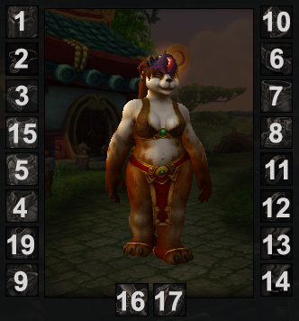

# Useful Information
This stuff doesn't belong to a specific expansion.

**__Darkmoon Faire:  Blight Boar__**<br/>
**Drummer**:  Avoid getting hit by any of the banshee waves, while still catching every bolt of light (Power Chord).<br/>
**Bassist**:  Avoid getting hit by any of the banshee waves, but miss at least 1 of the bolts of light.<br/>
**Vocals**:  Get hit by at least 2 banshee wave, while still catching every bolt of light.<br/>
**Guitarist**:  Get hit by at least 2 banshee wave, and miss at least 2 bolts of light.<br/>

**Miscellaneous macros using item slot numbers**

Main Hand weapon with `@mouseover`
```
#showtooltip
/use [@mouseover,help,exists,nodead][@target,help,exists,nodead][]16
```

Trinket 1 with `@mouseover`
```
#showtooltip
/use [@mouseover,help,exists,nodead][@target,help,exists,nodead][]13
```

Trinket 2 with `@cursor`
```
#showtooltip
/use [@cursor]14
```


Macro for announcing to /1 your target, location, and target health percentage.  Great for rares.
```Lua
/script px, py = C_Map.GetPlayerMapPosition(C_Map.GetBestMapForUnit("player"), "player"):GetXY()
/run t="target" SendChatMessage(format ("%s: %.1f, %.1f; HP: %i%%",UnitName(t),px*100,py*100,(UnitHealth(t)/UnitHealthMax(t)*100)),  "CHANNEL", nil, 1);
```
